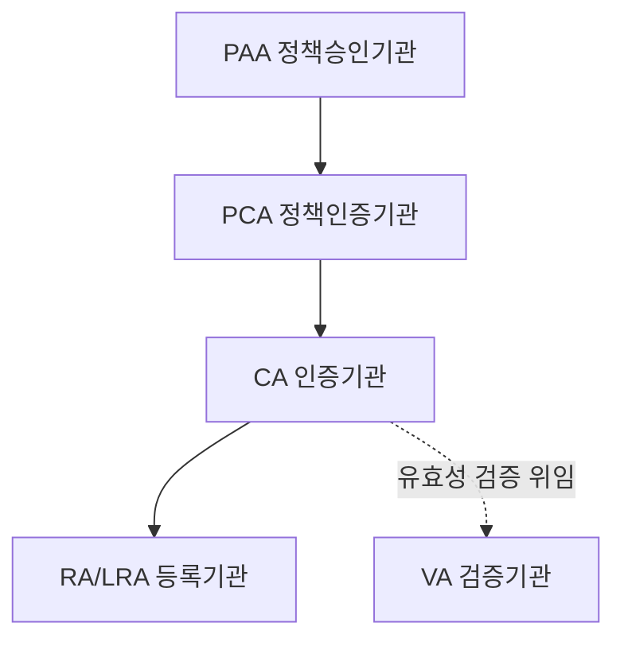

# 🔐 정보보안기사 오답노트 — 암호학 & 인증(PKI·전자서명)

> 헷갈렸던 문제 + 관련 개념 총정리 노트

이번 챕터는 암호 공격기법·대칭키 알고리즘·운용모드 같은 암호학 기초부터, 전자서명·PKI·인증서까지 범위가 꽤 넓어. 흐름대로 쭉 따라가면 자연스럽게 이어지도록 정리해봤어.

## 목차

1. 암호 공격 기법 4가지
2. DRM과 콘텐츠 보호 기술
3. 암호 설계 원리 & 분석 기법
4. 대칭키 암호 알고리즘
5. One Time Pad (OTP)
6. 블록암호 운용모드
7. 키 분배 방식
8. RSA 알고리즘의 안전성 조건
9. 해시함수 & MAC
10. 전자서명 기초
11. 전자서명 알고리즘 구조
12. 특수서명 vs 일반서명
13. 전자투표
14. 전자입찰시스템
15. PKI 구성요소
16. X.509 인증서 & 인증서 폐지 (CRL/OCSP)
17. SSO / HSM / DRM 총정리
18. 🎯 빠른 복습 요약표

---

## 1. 암호 공격 기법 4가지

공격자가 "무엇을 얼마나 갖고 있느냐"에 따라 강도가 세지는 순서로 이해하면 쉬워.

| 공격 기법 | 공격자가 가진 것 | 한 줄 설명 |
|---|---|---|
| **암호문 단독 공격** (Ciphertext-Only Attack) | 암호문만 | 가장 불리한 상황. 이것도 못 뚫으면 그 암호는 최소한의 안전성도 없는 것 |
| **기지평문공격** (Known-Plaintext Attack) | 평문-암호문 쌍 일부 | "이 부분은 원래 이런 내용"이라는 걸 이미 알고 있음 (ex. 편지의 정형화된 인사말) |
| **선택평문공격** (Chosen-Plaintext Attack) | 원하는 평문을 골라 암호화시켜본 결과 | 내가 원하는 평문을 넣고 "이게 암호화되면 어떻게 되는지" 실험 가능 |
| **선택암호문공격** (Chosen-Ciphertext Attack) | 원하는 암호문을 골라 복호화시켜본 결과 | 가장 강력함. 복호화 기계를 잠깐 빌려 쓰는 셈 |

> 💡 **쉽게 이해하기**: 잠긴 상자를 공격한다고 생각해봐. 암호문단독공격은 잠긴 상자만 보고 여는 것, 기지평문공격은 "이 상자엔 원래 이런 물건이 들어있었다더라"는 힌트가 있는 것, 선택평문공격은 상자 주인한테 "이거 넣고 잠가줘"라고 부탁할 수 있는 것, 선택암호문공격은 아예 "이거 좀 열어줘"라고 부탁할 수 있는 것에 가까워. 뒤로 갈수록 공격자한테 유리해지는 거지.

---

## 2. DRM과 콘텐츠 보호 기술

### ❌ 오답노트: DRM 기술과 가장 거리가 먼 용어

> **문제**: DRM 기술과 가장 거리가 먼 용어는? ① 워터마킹 ② 워터링홀 ③ 핑거프린팅 ④ Tampering 방지
> **정답**: ② 워터링홀

**왜?** 워터마킹, 핑거프린팅, 변조(Tampering) 방지는 전부 콘텐츠를 "보호"하는 DRM 기술이야. 근데 **워터링홀(Watering Hole)**은 정반대로 "공격" 기법이거든 — 특정 집단이 자주 방문하는 웹사이트를 미리 감염시켜놓고, 사자가 물웅덩이에서 사냥감을 기다리듯 방문자가 걸려들길 기다리는 사이버 공격이야. DRM(저작권 보호)이랑은 발음만 비슷하지 완전히 다른 분야라서 정답이 된 거야.

### 콘텐츠 보호 기술 정리

- **스테가노그래피(Steganography)**: 정보가 "숨겨져 있다는 사실 자체"를 숨기는 기술. 편지에 비밀잉크로 글을 쓰는 것처럼.
- **워터마킹(Watermarking)**: 콘텐츠 안에 **저작권자** 정보를 안 보이게 삽입. 지폐의 워터마크처럼 "이건 내 거야"를 증명.
- **디지털 핑거프린팅(Fingerprinting)**: 워터마킹이랑 방식은 비슷한데, 심는 정보가 저작권자가 아니라 **구매자(사용자)** 정보야. 사람마다 지문이 다르듯 배포본마다 다른 정보를 심어서, 나중에 불법 유출되면 "누가 유출했는지" 추적할 수 있게 해줘.
- **스마트태그**: 콘텐츠·상품에 부착해 정보를 담는 태그(RFID 등 활용). 유통 과정에서 식별·관리용으로 쓰임.
- **VOD DRM**: 주문형 비디오(Video-On-Demand) 서비스에 적용되는 DRM. 스트리밍 콘텐츠가 정해진 기간·횟수 안에서만 재생되도록 통제.
- **보안토큰**: 인증서나 암호키를 저장하는 휴대용 하드웨어 장치.

> 💡 **워터마킹 vs 핑거프린팅 한 방 정리**: 워터마킹 = "이 콘텐츠 주인은 나야" (저작권자 증명), 핑거프린팅 = "이 유출된 파일은 원래 누구한테 팔았던 거야" (유출자 추적). 둘 다 안 보이게 정보를 심는 건 똑같은데, 누구의 정보를 심느냐가 달라.

### ❌ 오답노트: DRM 구성요소 - 메타데이터

> **문제**: "콘텐츠의 생명주기 범위 내에서 관리되어야 할 각종 데이터의 구조 및 정보. 저작권자 정보, 미디어 정보 등을 포함." 이건 무엇을 설명한 것인가? (보기: 메타데이터, 패키저, 시큐어 컨테이너, DRM 제어기)
> **정답**: 메타데이터

**왜?** 이 지문은 딱 "정보를 담고 있는 데이터"에 대한 설명이라 메타데이터가 맞아. 나머지 셋은 전부 "무언가를 처리·실행하는 도구·장치"인 반면, 메타데이터는 순수하게 "정보 그 자체"거든.

### DRM 구성요소 전체 정리

| 구성요소 | 역할 | 비유 |
|---|---|---|
| **메타데이터** | 저작권자 정보, 이용규칙 등 콘텐츠에 대한 "설명 정보" | 상품에 붙은 라벨·설명서 |
| **패키저(Packager)** | 콘텐츠 + 메타데이터를 암호화해서 하나로 묶는 도구 | 택배 포장 담당 |
| **시큐어 컨테이너(Secure Container)** | 패키징 결과물, 암호화된 콘텐츠가 담긴 안전한 "상자" | 포장된 택배 박스 자체 |
| **DRM 제어기(Controller)** | 사용자가 실제 이용할 때 권한(재생횟수·기간 등)을 체크·통제 | 입구를 지키는 문지기 |
| **클리어링 하우스(Clearing House)** | 라이선스(키) 발급, 저작권료 정산을 대행 | 정산을 담당하는 은행·중개소 |

---

## 3. 암호 설계 원리 & 분석 기법

### 혼돈(Confusion) & 확산(Diffusion) — Shannon이 제시한 설계원리

- **혼돈**: 암호문과 키 사이의 관계를 최대한 복잡하게 숨기는 것. 주로 **치환(Substitution, S-Box)**으로 구현해.
- **확산**: 평문의 통계적 특성을 암호문 전체로 퍼뜨리는 것. 평문 한 비트만 바뀌어도 암호문 전체가 확 달라지게(눈사태 효과) 만드는 거야. 주로 **전치(Permutation)**로 구현해.

> 💡 **쉽게 이해하기**: 혼돈 = 물감 여러 개를 마구 섞어서 원래 어떤 색이었는지 못 알아보게 만드는 것. 확산 = 잉크 한 방울을 커다란 물통에 떨어뜨려서 전체에 골고루 퍼지게 하는 것. AES 같은 현대 블록암호는 이 두 원리를 라운드마다 반복 적용해.

### 차분(Differential) & 선형(Linear) 특성

이 둘은 바로 아래 나오는 "차분공격", "선형공격"과 짝을 이루는 설계 관점이야. 안전한 암호 알고리즘이라면 평문 쌍의 차이(차분)나 입출력 비트 간의 선형 근사식이 암호문과 뚜렷한 상관관계·규칙성을 보이면 안 돼. 설계 단계부터 "이런 패턴이 최대한 드러나지 않도록" 만드는 게 핵심이야.

### 암호 분석(공격) 기법 4가지

| 공격 | 원리 |
|---|---|
| **차분공격** (Differential Cryptanalysis) | 특정 평문 쌍의 차이(XOR)를 넣었을 때, 암호문 쌍의 차이가 특정 패턴으로 나올 확률을 분석해서 키를 유추 |
| **선형공격** (Linear Cryptanalysis) | 평문·암호문·키 비트 사이의 선형(XOR) 근사식을 찾고, 그 식이 성립할 확률이 50%에서 얼마나 벗어나는지로 키를 유추 |
| **전수공격** (Brute-force) | 가능한 모든 키를 다 대입해보는 무식하지만 확실한 방법. 키가 길면 사실상 불가능한 시간이 걸림 |
| **통계적 분석** | 암호문에 남아있는 언어의 통계적 특성(문자 빈도 등)을 분석. 시저 암호 같은 고전 암호에 특히 잘 먹힘 |

---

## 4. 대칭키 암호 알고리즘 (AES / SEED / ARIA)

| 알고리즘 | 개발 | 특징 |
|---|---|---|
| **AES** | 미국 NIST 표준 (원래 이름 Rijndael) | 128비트 블록 고정, 키는 128/192/256비트 중 선택, SPN 구조 |
| **SEED** | 한국 KISA 개발 | 128비트 블록, Feistel 구조, 한때 국내 인터넷뱅킹의 사실상 표준 |
| **ARIA** | 한국 국가기관·학계 공동개발 (이름 자체가 참여기관 이니셜) | AES와 유사한 SPN 구조, 경량 환경에 최적화 |

### ❌ 오답노트: 대칭키 vs 비대칭키 알고리즘 묶기

> **문제**: 대칭키 암호 알고리즘과 비대칭키 암호 알고리즘이 올바르게 묶인 것은?
> **정답**: 대칭키 = (AES, SEED, IDEA) / 비대칭키 = (RSA, ECC, Rabin)

**왜?** AES·SEED·IDEA는 전부 **같은 키**로 암호화·복호화하는 대칭키(비밀키) 방식이고, RSA·ECC·Rabin은 **공개키/개인키 쌍**을 쓰는 비대칭키 방식이야. (IDEA는 스위스에서 만든 블록암호로 예전 PGP에 쓰였고, Rabin은 RSA처럼 소인수분해 문제 기반 공개키 암호야.)

> 💡 **한 방 구분법**: 키를 하나만 쓰면 대칭키, 두 개(공개키+개인키)를 쓰면 비대칭키. 대칭키는 속도가 빨라서 실제 데이터 암호화에, 비대칭키는 느리지만 키교환·전자서명에 주로 쓰여.

---

## 5. One Time Pad (OTP)

- 평문과 **완전히 같은 길이**의, **완전히 랜덤한** 키를 **딱 한 번만** 사용하는 암호 (Vernam Cipher라고도 함)
- Shannon이 수학적으로 **완전 비밀성(Perfect Secrecy)**을 증명한 유일한 암호 방식이야 — 암호문만 봐서는 평문에 대해 어떤 정보도 얻을 수 없음
- 문제점: 키가 평문만큼 길어야 하니까 키를 안전하게 나눠주고 관리하는 게 사실상 불가능 → 실용성이 떨어짐

### ❌ 오답노트: OTP에 대한 설명 중 옳지 않은 것

> **정답(틀린 설명)**: "전수공격을 받게 되면 시간이 문제이지 궁극적으로 해독된다"

**왜 틀렸나?** 이게 OTP의 핵심 포인트야. AES 같은 일반 암호는 전수공격(모든 키 대입)을 하면 언젠가는 "진짜 정답 평문"이 튀어나와. 근데 OTP는 키가 완전히 랜덤하고 평문 길이만큼 기니까, 모든 가능한 키를 다 대입해보면 **말이 되는 모든 평문 후보가 전부** 튀어나와버려. 그중 뭐가 진짜 정답인지 구별할 방법이 전혀 없어. 그래서 시간을 아무리 많이 들여도(=전수공격을 해도) **절대** 해독이 안 되는 거지. "시간문제일 뿐 결국 뚫린다"는 말은 OTP한테는 틀린 말이야.

---

## 6. 블록암호 운용모드 (ECB / CBC / CFB / OFB / CTR)

| 모드 | 수식 | 핵심 특징 |
|---|---|---|
| **ECB** | `C_i = E_K(P_i)` | 블록마다 독립적으로 암호화. 같은 평문 블록 → 같은 암호문 블록 (패턴 노출 위험), 병렬처리 가능 |
| **CBC** | `C_i = E_K(P_i XOR C_(i-1))`, `C_0 = IV` | 이전 암호문과 XOR 후 암호화. 가장 널리 쓰임. 암호화는 순차적, 복호화는 병렬 가능 |
| **CFB** | `C_i = P_i XOR E_K(C_(i-1))` | 스트림 암호처럼 동작. 이전 암호문을 암호화해서 평문과 XOR |
| **OFB** | `O_i = E_K(O_(i-1))`, `C_i = P_i XOR O_i` | 스트림 암호처럼 동작. 키스트림을 미리 만들어둘 수 있고, 전송 오류가 다음 블록에 전파되지 않음 |
| **CTR** | `C_i = P_i XOR E_K(Counter_i)` | 카운터를 암호화해서 키스트림 생성. 병렬처리·랜덤 액세스 가능해서 실무에서 인기 |

> 💡 **쉽게 이해하기**:
> - **ECB** = 같은 재료로 같은 틀에 붕어빵 찍기. 재료(평문)가 같으면 모양(암호문)도 똑같이 나와서 패턴이 보여버림.
> - **CBC** = 도미노. 이전 블록이 넘어지면서(영향을 주면서) 다음 블록으로 쭉 이어짐.
> - **CTR** = 각 블록마다 번호표를 매겨서 독립적으로 처리 → 순서 상관없이 아무 블록이나 바로 복호화 가능 (동영상 스트리밍에 유리한 이유).

---

## 7. 키 분배 방식

### KDC(Key Distribution Center)를 이용한 방식
믿을 수 있는 제3의 기관(KDC)이 두 사용자를 위한 세션키를 만들어서 양쪽에 안전하게 나눠주는 방식이야. **Kerberos**가 이 방식의 대표주자.

> 💡 믿을 수 있는 친구(KDC)가 나랑 상대방한테 각각 같은 암호문(세션키)을 몰래 전해주는 것과 비슷해.

### Diffie-Hellman (DH)
두 사람이 **도청당해도 상관없는** 공개된 채널로 값을 주고받기만 해도, 제3자는 절대 알아낼 수 없는 **공통의 비밀키**를 만들어낼 수 있는 방법이야. **이산대수** 문제를 풀기 어렵다는 점에 안전성이 기반해.

**주요 특징**
- 사전에 아무 관계도 없던 두 사람이 공개 채널만으로 공통키 생성 가능 (최초의 공개키 아이디어, 1976년)
- 어디까지나 "키 교환" 프로토콜이지, 암호화나 전자서명 기능은 없음
- **인증** 기능이 없어서 중간자공격(MITM)에 취약함 → 실무에서는 인증서 등과 결합해서 사용

### RSA를 이용한 비밀키 분배
세션키(대칭키)를 상대방의 **RSA 공개키**로 암호화해서 보내면, 받는 사람만 자기 **개인키**로 복호화해서 세션키를 얻는 방식이야. 이후 실제 데이터는 속도 빠른 대칭키 암호로 주고받는 게 일반적 — 이게 흔히 쓰는 "하이브리드 암호시스템"의 기본 원리야.

---

## 8. RSA 알고리즘의 안전성 조건

| 조건 | 이유 |
|---|---|
| p, q는 충분히 큰 소수여야 함 | 작으면 소인수분해가 쉬워져서 n=pq가 바로 뚫림 |
| p, q는 크기가 비슷하되 너무 가까우면 안 됨 | 너무 가까우면 **페르마 인수분해법**에 취약해짐 (n의 제곱근 근처만 탐색해도 찾아짐) |
| p-1, q-1이 각각 큰 소인수를 가져야 함 | 그렇지 않으면 **폴라드 p-1 알고리즘** 같은 공격에 취약해짐 |
| gcd(e, φ(n)) = 1 | 공개지수 e가 φ(n)과 서로소여야 개인키 d(모듈러 역원)가 존재함 |

---

## 9. 해시함수 & MAC

### 강한 충돌내성 vs 약한 충돌내성

| 구분 | 정의 | 비유 |
|---|---|---|
| **강한 충돌내성** (충돌 저항성, Collision Resistance) | H(x) = H(x')를 만족하는 **아무** x, x' 쌍을 찾기 어려움 | "세상 어딘가에 지문이 똑같은 두 사람을 아무나 찾아봐라" (둘 다 자유롭게 골라도 됨 → 훨씬 어려움) |
| **약한 충돌내성** (제2원상저항성, 2nd Preimage Resistance) | **특정** x가 주어졌을 때, H(x)=H(x')인 다른 x'를 찾기 어려움 | "이 사람이랑 지문이 똑같은 다른 사람을 찾아봐라" (한쪽이 고정됨 → 상대적으로 조건이 약함) |

### MDC (Modification Detection Code)
해시함수의 한 분류로, **키를 사용하지 않고** 순수하게 메시지의 무결성만 검증하는 용도야. **MD5, SHA-1, SHA-2(SHA-256 등), SHA-3** 계열이 여기 속해.

### MAC vs 해시함수
둘 다 무결성을 확인하는 데 쓰이지만 결정적 차이는 **키의 유무**야.
- **해시함수**: 키 없음 → 누구나 계산 가능 → **무결성**만 보장
- **MAC**: 비밀키 있음 → 키를 아는 사람만 계산·검증 가능 → **무결성 + 인증**까지 보장

> 💡 MAC은 "키가 들어간 해시"라고 생각하면 딱 맞아. (실제로 HMAC = 해시함수 + 비밀키 조합)

---

## 10. 전자서명 기초

### 전자서명의 요구조건

| 조건 | 의미 |
|---|---|
| **위조 불가** (Unforgeable) | 정당한 서명자만 유효한 서명을 만들 수 있어야 함 |
| **서명자 인증** (Authentication) | 서명을 보고 누가 서명했는지 검증할 수 있어야 함 |
| **부인 불가** (Non-repudiation) | 서명자가 나중에 "나 서명 안 했다"고 발뺌할 수 없어야 함 |
| **재사용 불가** (Not Reusable) | 한 문서에 한 서명을 다른 문서에 잘라 붙여 재사용할 수 없어야 함 |
| (+변경 불가, Unalterable) | 서명된 내용이 조금이라도 바뀌면 서명이 무효가 되어야 함 |

### 전자서명 = "개인키로 암호화"
전자서명은 기본적으로 공개키 암호를 **거꾸로** 쓰는 개념이야. 일반 암호화는 "공개키로 암호화 → 개인키로 복호화"인데, 전자서명은 **"개인키로 암호화(=서명) → 공개키로 복호화(=검증)"**야. 개인키는 나만 갖고 있으니까, 그걸로 만든 서명은 나만 만들 수 있다는 게 핵심 원리.

### RSA 전자서명
서명자가 메시지(정확히는 아래에서 설명할 해시값)를 자신의 **개인키**로 암호화 → 이게 서명. 검증자는 서명자의 **공개키**로 복호화해서 원래 값이 나오는지 확인해.

### ❌ 오답노트: 왜 원본이 아니라 해시값에 서명하나?

> **문제**: 긴 메시지의 해시값을 생성해서 개인키로 서명하고, 검증자는 해시값을 비교해서 검증한다. 이렇게 하는 가장 근본적인 이유는?
> ① 전자서명 알고리즘 특성상 서명·검증 속도가 데이터량에 큰 영향을 받기 때문
> ② 국제표준으로 규정된 것이기 때문
> ③ 해시함수로 생성된 해시값이 안전한 전자서명을 보장하기 때문
> ④ 전자서명에 대칭암호시스템이 사용되기 때문
> **정답**: ①

**왜?** 공개키 연산(서명·검증)은 원래 계산이 무겁고 느려. 메시지 원본 전체에 서명하면 데이터가 클수록 서명·검증 시간이 엄청 늘어나겠지. 그래서 고정된 짧은 길이의 해시값 하나에만 서명하면, 원본이 아무리 길어도 서명·검증 속도가 항상 일정하고 빨라져 — **속도(효율성) 문제**가 근본 이유야. (③번은 인과관계가 반대야. 해시가 서명을 안전하게 만드는 게 아니라, 속도 때문에 해시를 쓰는 거지. ④번도 틀렸어, 전자서명은 대칭키가 아니라 **비대칭키(공개키)** 암호를 사용해.)

### ❌ 오답노트: 전자서명을 적용한 예가 아닌 것

> **문제**: 전자서명을 적용한 예에 해당되지 않는 것은? (보기: Code Signing, X.509 Certificate, SSL/TLS Protocol, Kerberos Protocol)
> **정답**: Kerberos Protocol

**왜?** Code Signing(소프트웨어에 서명), X.509 인증서(CA가 개인키로 서명), SSL/TLS(서버 인증서에 전자서명 활용)는 전부 **공개키 기반 전자서명**이 들어가 있어. 근데 **Kerberos**는 다르게 동작해 — KDC가 발급하는 티켓·세션키가 전부 **대칭키**로 암호화되는 구조거든(위 7번 KDC 방식 기억나지?). 공개키·개인키 쌍을 쓰는 전자서명 개념 자체가 안 들어가있기 때문에 정답이 된 거야.

---

## 11. 전자서명 알고리즘 구조

| 알고리즘 | 기반 문제 | 특징 |
|---|---|---|
| **RSA 서명** | 소인수분해 문제 | 개인키로 암호화 = 서명. 암호화 기능도 겸용 가능 |
| **Schnorr 서명** | 이산대수 문제 | RSA보다 서명 생성 구조가 간단·효율적. 영지식증명과도 연관 있음 |
| **DSS** (Digital Signature Standard) | 이산대수 문제 | 미국 NIST의 전자서명 표준, 내부적으로 DSA 알고리즘 사용. **서명 전용**이라 암호화 기능은 없음 (RSA와 차이점) |
| **ECDSA** | 타원곡선 이산대수 문제 | DSA를 타원곡선 위에서 구현. 같은 안전성이라도 키 길이가 훨씬 짧아서 효율적 (비트코인 등에서 사용) |

---

## 12. 특수서명 vs 일반서명

### ❌ 오답노트: 성격이 다른 전자서명 하나 고르기

> **문제**: 전자서명은 사용목적에 따라 특수 서명과 일반 서명으로 나눌 수 있다. 성격이 다른 하나는? ① 부인 방지 전자서명 ② 복호형 전자서명 ③ 의뢰 부인 방지 전자서명 ④ 수신자 지정 전자서명
> **정답**: ② 복호형 전자서명

**왜?** ①③④는 전부 "특별한 목적"을 위해 일반 서명에 기능을 추가한 **특수목적 서명**이야. 반면 **복호형 전자서명(메시지 복원형)**은 목적이 아니라, 서명 검증 시 원문이 서명 안에서 "복원되느냐 아니냐"를 기준으로 나눈 **일반 서명의 분류**(메시지 첨부형 vs 메시지 복원형)에 해당해. 즉 분류 기준 자체가 다른 거라서 성격이 다른 거지.

> 💡 **참고**: 부인방지서명은 서명자 본인의 협조 없이는 검증이 안 되게 만들어서 함부로 복사·유포되는 걸 막는 서명이고, 수신자지정서명은 지정된 특정 수신자만 검증할 수 있는 서명이야.

---

## 13. 전자투표

### 요구조건

| 요건 | 의미 |
|---|---|
| **완전성** (Completeness) | 유효한 모든 표가 빠짐없이 정확하게 집계됨 |
| **익명성** (Anonymity) | 투표 내용으로 누가 투표했는지 알 수 없음 |
| **건전성** (Soundness) | 부정한 방법이 투표 결과에 영향을 줄 수 없음 |
| **이중투표방지** (Unreusability) | 이미 투표한 사람은 다시 투표할 수 없음 |
| **정당성 / 적임성** (Eligibility) | 투표 자격이 있는 사람만 투표에 참여할 수 있음 (이 둘은 거의 같은 맥락으로 묶여서 나오는 개념이야) |
| **검증 가능성** (Verifiability) | 투표자 본인 또는 누구나 결과가 제대로 반영됐는지 확인 가능 |

> 💡 이 요건들을 한마디로 하면 "**투명하지만 사생활은 지켜지는 투표함**"을 만드는 조건들이야. 다들 결과를 검증할 수 있어야 하는데(검증가능성), 동시에 누가 뭘 찍었는지는 아무도 몰라야 하니까(익명성) — 이 둘을 동시에 만족시키는 게 전자투표 암호기술의 핵심 난제야.

### 전자투표 방식 3가지

| 방식 | 장소의 자유도 |
|---|---|
| **PSEV** (Poll Site Electronic Voting) | 지정된 투표소에서만 (기존 투표소 + 전자기기) |
| **Kiosk 투표** | 관공서·공공장소 등에 설치된 키오스크 여러 곳 중 아무데서나 |
| **REV** (Remote Electronic Voting) | 개인 PC·스마트폰으로 어디서나 (가장 편리하지만 신원확인·강요방지가 가장 어려움) |

---

## 14. 전자입찰시스템

전자투표랑 요구조건이 거의 판박이야.

- **공정성**: 특정 입찰자한테 유리한 정보가 새면 안 됨
- **안전성**: 개찰 전까지 입찰 가격이 노출되면 안 됨 (봉인입찰, Sealed-bid 개념)
- **익명성**: 다른 입찰자가 "누가 얼마 썼는지" 알 수 없음
- **부인방지**: 낙찰자가 나중에 자기가 쓴 가격을 부인할 수 없음

그래서 전자투표에서 쓰이는 은닉서명·커미트먼트 같은 암호기술이 전자입찰에도 그대로 자주 활용돼.

---

## 15. PKI 구성요소

| 기관 | 정식명칭 | 역할 | 비유 |
|---|---|---|---|
| **PAA** | Policy Approval Authority (정책승인기관) | 최상위, PKI 전체 정책 결정 | 헌법 제정 |
| **PCA** | Policy Certification Authority (정책인증기관) | 정책 시행, 하위 CA 관리·인증 | 정책 집행 부처 |
| **CA** | Certification Authority (인증기관) | 실제 인증서 **발급·서명** | 신분증 발급 본청 |
| **RA** | Registration Authority (등록기관) | 사용자 **신원확인**을 대행 | 접수 창구 |
| **LRA** | Local RA (지역등록기관) | RA의 지역 분산 버전 | 동네 주민센터 |
| **VA** | Validation Authority (검증기관) | 인증서가 지금 유효한지 실시간 확인 | 신용조회 서비스 |

> 🔑 **핵심**: "**신원 확인은 RA, 실제 발급(서명)은 CA**"라는 역할 분담을 꼭 기억해둬. RA는 사람을 확인만 하고, 도장(서명)을 찍는 권한은 CA한테만 있어.

---

## 16. X.509 인증서 & 인증서 폐지 (CRL/OCSP)

### 전자인증서란
공개키와 그 소유자를 연결(바인딩)해주는 전자문서야. "이 공개키는 진짜 이 사람 것이다"를 CA라는 신뢰기관이 보증해주는 거지 — 온라인 세계의 **전자 신분증**이라고 보면 돼.

### X.509 인증서의 주요 필드

| 필드 | 내용 |
|---|---|
| 버전(Version) | 인증서 형식 버전 |
| 일련번호(Serial Number) | CA가 부여하는 고유 번호 |
| 서명 알고리즘 | 인증서 서명에 쓰인 알고리즘 |
| 발급자(Issuer) | 발급한 CA 정보 |
| 유효기간(Validity) | 시작일 ~ 만료일 |
| 주체(Subject) | 인증서의 소유자 |
| 주체 공개키 정보 | 소유자의 공개키 |
| (v3) 확장영역 | 용도 제한 등 추가 정보 |
| CA의 전자서명 | 위 모든 내용에 대한 CA의 서명 (위변조 방지) |

### CRL (Certificate Revocation List)

폐지된 인증서들의 "블랙리스트"야. 아래 정보들을 포함해:
- 발급자(CA) 정보
- 이번 갱신일 / 다음 갱신 예정일
- 폐지된 인증서들의 **일련번호 목록** + 각각의 **폐지 일자·사유**

### 인증서 폐지 확인 방법: CRL vs OCSP

| 방식 | 방법 | 실시간성 |
|---|---|---|
| **CRL** | 주기적으로 배포되는 리스트를 다운받아 직접 대조 | 낮음 (방금 폐지된 건 다음 배포 전까지 반영 안 됨) |
| **OCSP** (Online Certificate Status Protocol) | 서버에 "이 인증서 지금 유효해?"라고 물어보고 즉시 응답 받음 | 높음 (실시간) |

> 💡 CRL = 매일 아침 나눠주는 종이 블랙리스트, OCSP = 전화 한 통으로 즉시 확인하는 신용조회. OCSP가 CRL의 "실시간성 부족" 문제를 해결하려고 나온 방식이야.

---

## 17. SSO / HSM / DRM 총정리

- **SSO (Single Sign-On)**: 한 번 로그인하면 연계된 여러 시스템을 추가 로그인 없이 이용. 사원증 하나로 회사 여러 출입문을 다 여는 것과 비슷.
- **HSM (Hardware Security Module)**: 암호키를 안전하게 생성·저장·관리하는 **전용 하드웨어**. 키를 그냥 파일로 두면 해킹에 취약하니까, 물리적으로 분리된 금고 같은 장치에 넣어두는 거야.
- **DRM (Digital Rights Management)**: 위 2번에서 다룬 전체 개념 — 디지털 콘텐츠의 저작권을 보호하고 이용 규칙을 통제하는 기술 체계 전반.

---

## 18. 🎯 빠른 복습 — 오답노트 요약표

| # | 문제 | 정답 | 핵심 이유 |
|---|---|---|---|
| 1 | DRM 기술과 거리가 먼 것 | 워터링홀 | DRM(보호기술)이 아니라 사이버 공격 기법 |
| 2 | 저작권자 정보 등을 담은 DRM 구성요소 | 메타데이터 | "정보 그 자체"만 설명하는 지문 |
| 3 | 대칭키/비대칭키 알고리즘 묶기 | (AES,SEED,IDEA) / (RSA,ECC,Rabin) | 키 1개 vs 키 2개(공개+개인) 구분 |
| 4 | OTP 관련 틀린 설명 | "전수공격받으면 결국 해독된다" | OTP는 완전 비밀성 → 전수공격해도 정답 구별 불가 |
| 5 | 해시값에 서명하는 근본 이유 | 서명·검증 속도가 데이터량에 영향받기 때문 | 공개키 연산이 무거워서 짧은 해시값만 서명 |
| 6 | 전자서명 적용 예가 아닌 것 | Kerberos | 대칭키(KDC) 기반이라 공개키 전자서명 미사용 |
| 7 | 성격이 다른 전자서명 | 복호형 전자서명 | 목적별 분류(특수서명)가 아니라 구조별 분류(일반서명) |

---

*정보보안기사 학습 노트 — 암호학 & 인증(PKI·전자서명) 챕터*
